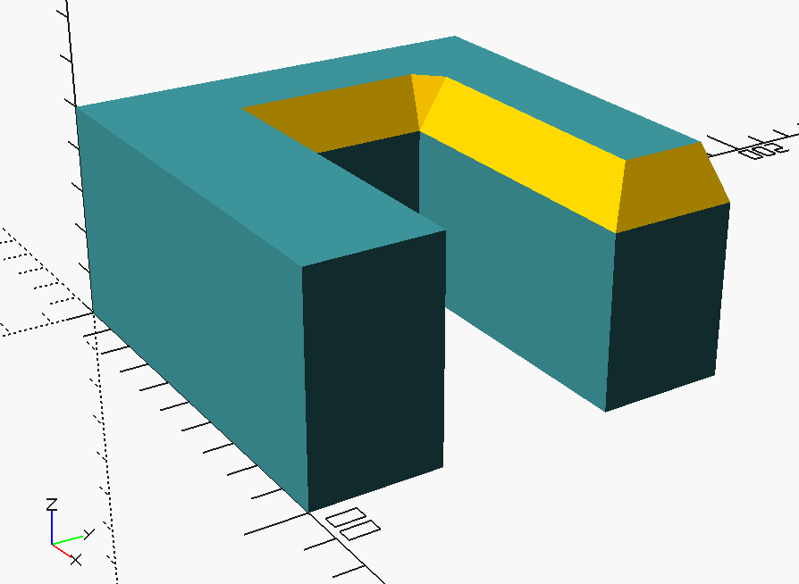
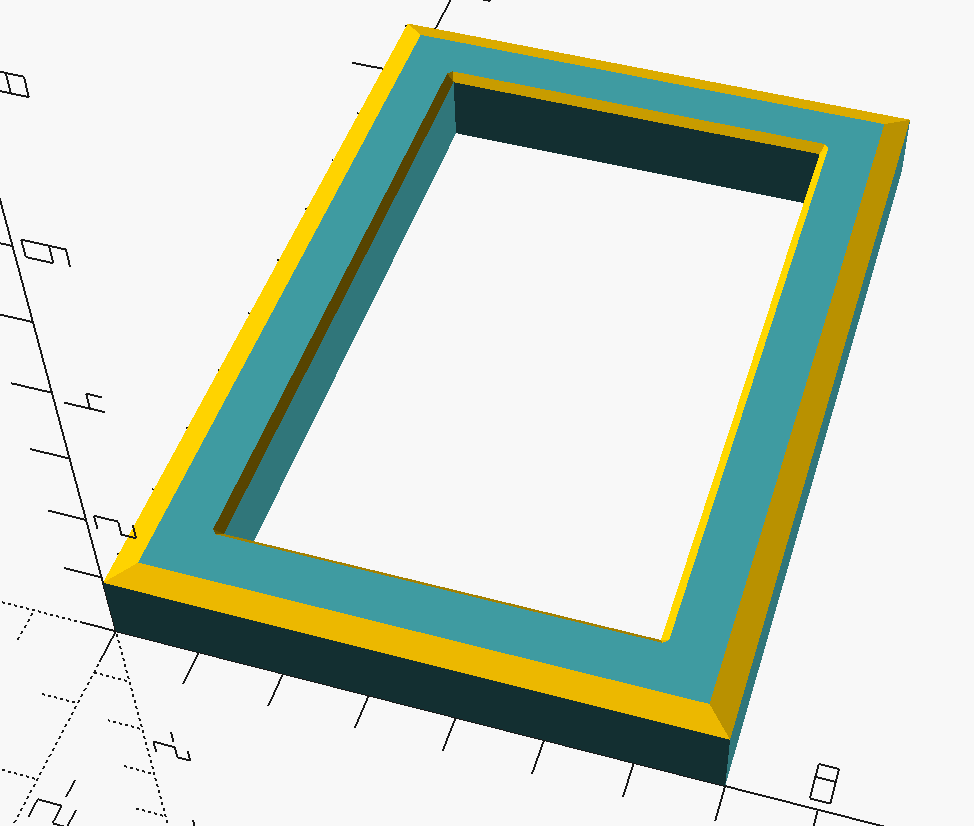
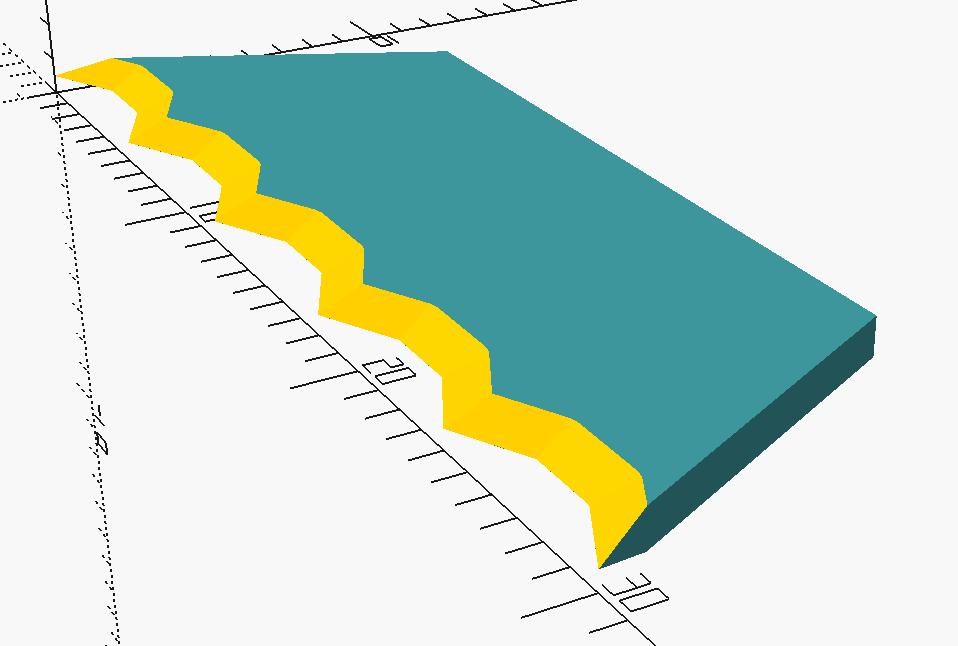
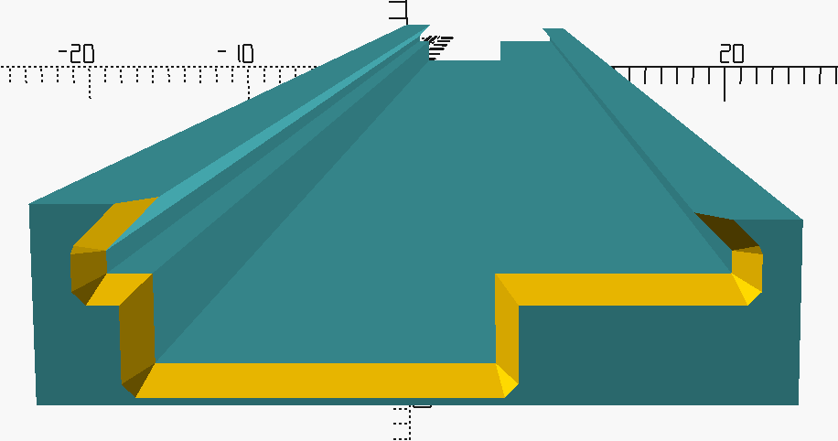
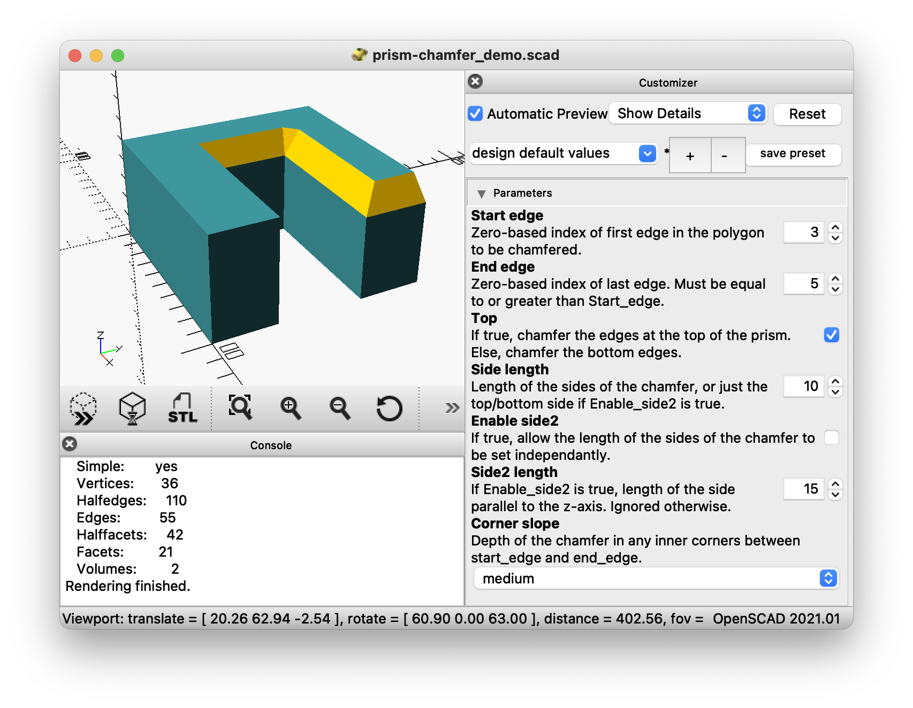
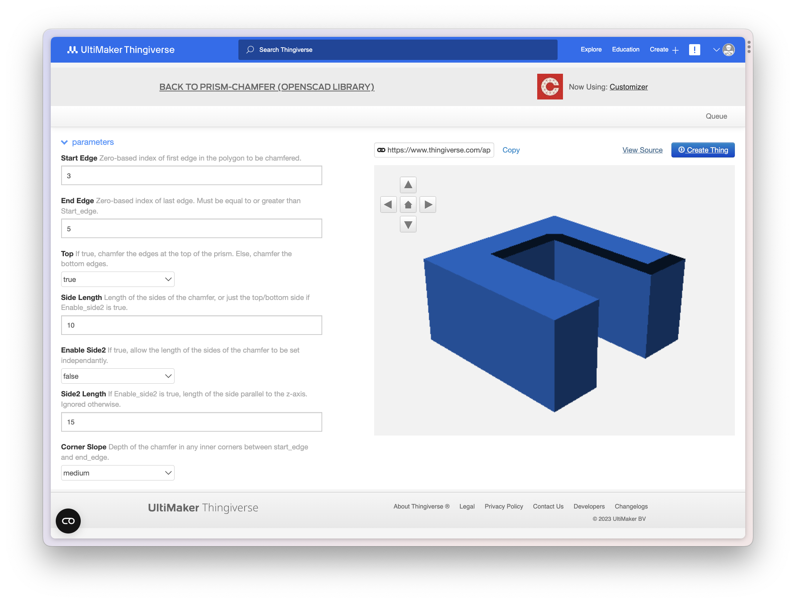
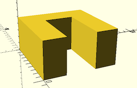
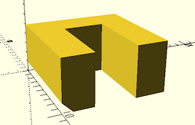
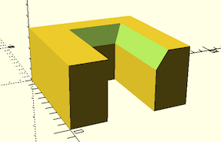
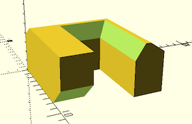

# prism-chamfer

> The missing chamfer tool for OpenSCAD

Add chamfers to your OpenSCAD models. Any edge you can model as part of a prism, you can chamfer easily. Any edge you can't, might be a bit harder.

## What?

This is a library for use in [OpenSCAD](https://openscad.org/index.html). It makes it easy to chamfer edges of a prism. A chamfer, also called a bevel, is a smooth slope that cuts off a 90° edge. A prism is a 3D body with a continuous cross-section. In OpenSCAD you create prisms by applying a `linear_extrude` to a `polygon`. Although OpenSCAD provides other ways to form solids, this technique of drawing a 2D shape (a polygon) and "extruding" it is  common in many 3D CAD tools.

So for the price of modelling your designs in the "extrude a sketch" fashion, you get the ability to chamfer any combination of the resulting edges. More importantly, you can do so without concerning yourself with the geometric details of the edges - you just need the points of your polygon.

## Gallery

| Picture Frame | Serrated Blade | Tape Slot |
| ------------- | -------------- | --------- |
|  |  |  | 

## Demo

Worth a thousand pictures, so I've heard.

Download this repo, open [prism-chamfer_demo.scad](prism-chamfer_demo.scad) in OpenSCAD and show the Customizer pane. The demo file presents a basic prism and exposes all the major library parameters to chamfer it.

You can also save the trouble of downloading anything, and just head straight to the equivalent on Thingiverse:
 
[https://www.thingiverse.com/apps/customizer/run?thing_id=6150590](https://www.thingiverse.com/apps/customizer/run?thing_id=6150590)

You'll need an account, and the interface is a bit janky, but it's a handy preview.

## Usage

The library is designed for use with a single public interface, `prism_chamfer_mask()`. To use it, copy `prism-chamfer.scad` into your [library folder](https://en.wikibooks.org/wiki/OpenSCAD_User_Manual/Libraries), then simply start with a prism:

    polygon_points = [[0,0],[10,0],[10,3],[3,3],[3,7],[10,7],[10,10],[0,10]];
    h=5;
    linear_extrude(height=h)
      polygon(polygon_points, convexity=2);

Include the library and difference the prism with `prism_chamfer_mask()`:

    include <prism-chamfer.scad>;
    
    difference() {
      polygon_points = [[0,0],[10,0],[10,3],[3,3],[3,7],[10,7],[10,10],[0,10]];
      h=5;
      linear_extrude(height=h)
        polygon(polygon_points, convexity=2);

      prism_chamfer_mask(polygon_points);
    }

> Note from this point on you might need to "Render" in OpenSCAD instead of "Preview" for your work to appear correctly

Then configure as you desire:

    include <prism-chamfer.scad>;
    
    difference() {
      polygon_points = [[0,0],[10,0],[10,3],[3,3],[3,7],[10,7],[10,10],[0,10]];
      h=5;
      linear_extrude(height=h)
        polygon(polygon_points, convexity=2);

      prism_chamfer_mask(polygon_points, start_edge=3, end_edge=4, height=h,
                         side=1.0, side2=1.5, corner_slope="deep");
    }

If you wish to chamfer multiple discontiguous edges, just call `prism_chamfer_mask()` multiple times:

    include <prism-chamfer.scad>;
    
    difference() {
      polygon_points = [[0,0],[10,0],[10,3],[3,3],[3,7],[10,7],[10,10],[0,10]];
      h=5;
      linear_extrude(height=h)
        polygon(polygon_points, convexity=2);

      prism_chamfer_mask(polygon_points, start_edge=3, end_edge=4, height=h,
                         side=1.0, side2=1.5, corner_slope="deep");
      prism_chamfer_mask(polygon_points, start_edge=1, end_edge=1, height=0,
                         side=2.0);
      prism_chamfer_mask(polygon_points, start_edge=6, end_edge=7, height=h,
                         side=1.5, side2=1.0);
    }

If `prism_chamfer_mask()` is not ticking your boxes, you can call the constituent modules directly and make your own masks. See [prism-chamfer.scad](prism-chamfer.scad) for details.

## Motivation

I finally dived into OpenSCAD to programmatically create some tape holders for my [pick and place machine](https://twitter.com/HeathRaftery/status/1676949667681280000?s=20). I originally modelled them in Fusion 360, but now I'm happy with them I want to be able to quickly generate variations. Progammable CAD to the rescue.

About 30 seconds in I realised the all important chamfers that guide the tapes into the holders were going to be a right royal pain in OpenSCAD. Cue a journey through [many](https://www.reddit.com/r/openscad/comments/9bclt1/csg_the_best_kept_secret_on_fillets_and_chamfers/), [many](https://www.reddit.com/r/openscad/comments/e27qdb/bevel_command/) similar laments.

I started playing with the masks in [BOSL](https://github.com/revarbat/BOSL/wiki/masks.scad#fillet) and [corner-tools](https://www.myminifactory.com/object/3d-print-tools-for-fillets-and-chamfers-on-edges-and-corners-straight-and-or-round-45862), and my fears were allayed - if only I could position the masks right, chamfers would come my way. But surely there's a better way to position and size the masks than painstakingly calculating the geometry of every edge? If only there was some sort of... programmable CAD tool... then I could free my feeble mind from the arithmetic and let the computer do the chores!

And so it began. With my grand sum of OpenSCAD experience consisting of doing the cars in the beginner's tutorial, I embarked on a chamfer library. Pretty soon I realised even the masks in `BOSL` and `corner-tools` weren't going to cut the mustard, so a wrapper that just does the positioning was out. Fortunately, modelling the masks is the easy part, and as a bonus the library becomes self-contained.

Getting the abstraction right was a journey, and lots of code hit the cutting room floor. I even tripped and fell into developing some fairly novel (in the can't-find-it-on-Google sense) [geometry algorithms](https://math.stackexchange.com/questions/3549762/trig-is-there-a-formula-that-finds-middle-between-two-angles-with-non-right-tri/4750179#4750179) to get the job done. In the end, I'm shocked its only 150 lines and pleasantly surprised I was able to boil it down to a single interface. Hopefully the value density is high, and it can be widely used as a generic chamfering tool.

## Contributing

At this point I have about 30 hours total experience with OpenSCAD, 28 of which were spent writing this library. Chances are high that there's much room for improvement. I warmly welcome criticism and suggestions.

Here's some guidelines:

- I'd like this library to be generic and widely applicable, but also acutely narrow in scope. Policing that line is what I have to offer.
	- I imagine that a greater user experience would come from getting absorbed into a bigger library, rather than trying to grow this one into everything for everyone.
- I expect, but may well be proved naive, that improvements will tend to be:
	- bug fixes - there are *lots* of edge cases that I will have missed
	- usability - my ignorance of OpenSCAD conventions knows no bounds
	- features - chamfer styles? collision detection?
	- documentation - examples? animations?
	- scope - better interface? broader applicability?
- But I'm also interested in broader "is this really the right solution?" discussions.
- There are zero guarantees I will be responsive, but I intend to be.
- All code will pass through the Heath linter. I like 2 space tabs, lines to generally be less than 100 characters and using whitespace for clarity. Code is for humans - the robots don't care.
- All maintenance will be via the mechanisms of our benevolent dictator, GitHub, so get Issue-ing and PR'ing.

## Contact

My contact page is [here](https://www.empirical.ee/contact/).
